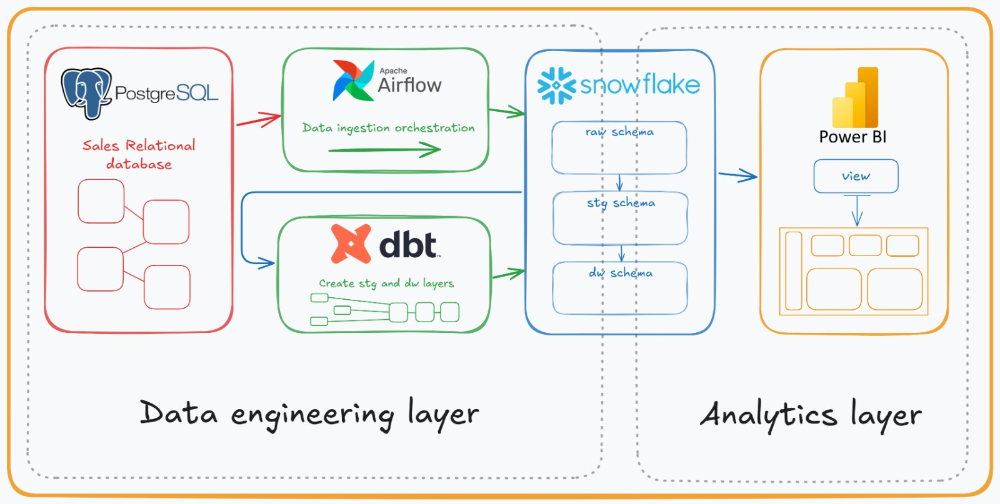

# Nova Drive data engineering project.

### The Nova Drive project is a data engineering project that uses a database in the Postgres database to simulate the sales system of a car dealership. This database is made available through the course [access link](https://www.udemy.com/course/bootcamp-engenharia-de-dados/) taught by Fernando Amaral in his data engineering bootcamp.

## Description

#### The project basically consists of two stages: the first is the data engineering layer and the second is the data analysis layer. In the first layer, data is collected from a postgres database of a fictitious car dealership and is stored in a raw layer in the snowflake database using Apache Airflow as the data ingestion mechanism. DBT is then used to process the data for the staging and dw layers in Snowflake. In the second layer, an analytics view is created also using DBT with specific objectives for a data analysis project developed in Power BI. The goal is to present an end-to-end solution using some of the main modern data engineering and analysis tools.
&nbsp;

&nbsp;

## Data engineering layer

#### The data engineering layer can be divided into a few steps. They are: Data ingestion by Airflow; creation of the raw layer in the Snowflake database; and data transformation using DBT.

### Data ingestion by Airflow

#### To configure Apache Airflow, a Docker container was initialized on an instance created on AWS EC2. The configurations were made so that Airflow could connect to the Postgres database, identify the tables needed for the process and load them into the Snowflake database.
&nbsp;

&nbsp;

#### Loading data from Postgres database tables is done in full load mode. Below is the Python code for the functions contained in the DAG that performs this process. The first function is exclusively for loading data into Airflow memory and the second function performs the necessary load on the raw tables of the Snowflake database.
&nbsp;
```python
def extract_table(table_name, **kwargs):
    postgres_hook = PostgresHook(postgres_conn_id="postgres")
    query = f"SELECT * FROM {table_name}"
    connection = postgres_hook.get_conn()
    cursor = connection.cursor()
    cursor.execute(query)
    rows = cursor.fetchall()
    col_names = [desc[0] for desc in cursor.description]
    df = pd.DataFrame(rows, columns=col_names)
    
    for col in df.select_dtypes(include=['datetime64[ns]', 'datetime64[ns, UTC]']):
        df[col] = df[col].astype(str)
    
    kwargs['ti'].xcom_push(key=f"{table_name}_data", value=df.to_dict(orient='records'))
```

&nbsp;
```python
def load_table(table_name, **kwargs):
    table_data = kwargs['ti'].xcom_pull(key=f"{table_name}_data", task_ids=f"extract_{table_name}")
    df = pd.DataFrame(table_data)
    
    snowflake_hook = SnowflakeHook(snowflake_conn_id="snowflake")
    engine = snowflake_hook.get_sqlalchemy_engine()
    df.to_sql(table_name, con=engine, schema='RAW', if_exists='replace', index=False)
```

#### The DAG execution is demonstrated in the images below. Each table represents a different execution within the flow. Since this is a simple full load, only one DAG is necessary in this loading process.

&nbsp;

&nbsp;
&nbsp;

&nbsp;

### Snowflake raw database

#### The first data layer in the Snowflake database intended as the destination for the loading step performed by Apache Airflow is called the raw layer. In this layer, the tables created are identical to the tables in the source Postgres database, they do not have primary or foreign keys and their purpose is exclusively to decouple the source database, maintaining the internal data transformation processes in Snowflake.
&nbsp;
```sql
CREATE DATABASE NOVADRIVETH;
CREATE SCHEMA RAW;
 
CREATE WAREHOUSE DEFAULT_WH;
 
CREATE TABLE veiculos (
    id_veiculos INTEGER,
    nome VARCHAR(255) NOT NULL,
    tipo VARCHAR(100) NOT NULL,
    valor DECIMAL(10, 2) NOT NULL,
    data_atualizacao TIMESTAMP_LTZ,
    data_inclusao TIMESTAMP_LTZ
);
```
&nbsp;
### Data transformation using DBT

#### The steps related to the transformations are all executed from models built in DBT from the data included in the raw tables.
#### Initially, the project is configured in DBT Cloud with the basic information in the dbt_project.yml file. Next, the models are created following the hierarchy that we can see in the diagram at the beginning of this document. The Staging Layer is created in Snowflake using simple data processing from the raw layer. The DW Layer, where the data is definitively divided between the dimension and fact tables, is built from the staging layer. Examples of this processing can be seen below.

&nbsp;
#### Layer configuration in the dbt_project.yml file
```yml
models:
  NovaDrive_analytics_layer:   
    staging:
      +materialized: table
      +schema: STAGING
    dw:
      +materialized: table
      +schema: DW
    analytics:
      +materialized: view
      +schema: ANALYTICS
```
&nbsp;

#### Example of building a sales staging model

```sql
{{ 
    config(
        schema='STAGING',
        materialized='table',
        tags=['stg_vendas', 'staging']
    ) 
}}

WITH source AS (
    SELECT
        id_vendas,
        id_veiculos,
        id_concessionarias,
        id_vendedores,
        id_clientes,
        valor_pago::DECIMAL(10,2) AS valor_venda, 
        data_venda,
        data_inclusao,
        COALESCE(data_atualizacao, data_venda) AS data_atualizacao
    FROM {{ source('sources', 'VENDAS') }}
)

SELECT
    id_vendas,
    id_veiculos,
    id_concessionarias,
    id_vendedores,
    id_clientes,
    valor_venda,
    data_venda,
    data_inclusao,
    data_atualizacao
FROM source
```
&nbsp;

#### Example of building a sales fact table model (DW layer)

```sql
{{ 
    config(
        schema='DW',
        materialized='incremental', 
        unique_key='venda_id',
        tags=['fct_vendas', 'dw']
        ) 
}}

WITH vendas AS (
    SELECT
        v.id_vendas AS venda_id,
        vei.sk_veiculo,
        con.sk_concessionaria,
        ven.sk_vendedor,
        cli.sk_cliente,
        v.valor_venda, 
        v.data_venda,
        v.data_inclusao,
        v.data_atualizacao
    FROM {{ ref('stg_vendas') }} v
    JOIN {{ ref('dim_veiculos') }} vei ON v.id_veiculos = vei.veiculo_id
    JOIN {{ ref('dim_concessionarias') }} con ON v.id_concessionarias = con.concessionaria_id
    JOIN {{ ref('dim_vendedores') }} ven ON v.id_vendedores = ven.vendedor_id
    JOIN {{ ref('dim_clientes') }} cli ON v.id_clientes = cli.cliente_id
)

SELECT
    {{ dbt_utils.generate_surrogate_key(['venda_id']) }} AS sk_venda,
    venda_id,
    sk_veiculo,
    sk_concessionaria,
    sk_vendedor,
    sk_cliente,
    valor_venda,
    data_venda,
    data_inclusao,
    data_atualizacao
FROM vendas

    WHERE venda_id > (SELECT MAX(venda_id) FROM {{ this }})

```
&nbsp;

## Data analysis layer

#### The data analysis layer is responsible for creating views and other reports from the production data warehouse tables (dw schema in the Snowflake database). The views created ready for reporting or use as a data source in data analysis projects such as in Power BI are under the analytics schema in Snowflake and they are created using DBT.

### DBT analytics layer

#### Below, we can see how a view is created using DBT and what relationships are necessary for the complete formation of the report with the relevant data that guarantee the quality of the analysis.

&nbsp;
```sql
{{ 
    config(
        schema='ANALYTICS',
        materialized='view',         
        tags=['vw_vendas', 'analytics']
        ) 
}}

WITH vendas AS(
    SELECT 
        venda_id,
        sk_veiculo,
        sk_concessionaria,
        sk_vendedor,
        sk_cliente,
        valor_venda,
        data_venda,
        data_inclusao,
        data_atualizacao
    FROM {{ ref('fct_vendas') }}
),

veiculos AS(
    SELECT
        sk_veiculo,   
        nome_veiculo,
        tipo,
        valor_sugerido
    FROM {{ ref('dim_veiculos') }}
),

concessionarias AS(
    SELECT
        sk_concessionaria,   
        nome_concessionaria,
        cidade_id
    FROM {{ ref('dim_concessionarias') }}
),

vendedores AS(
    SELECT
        sk_vendedor,   
        nome_vendedor   
    FROM {{ ref('dim_vendedores') }}
),

clientes AS(
    SELECT
        sk_cliente,    
        nome_cliente,
        endereco,
    FROM {{ ref('dim_clientes') }}
)

SELECT
    VE.venda_id,
    VE.valor_venda,
    CAST(TO_VARCHAR(CAST(VE.data_venda AS DATE), 'YYYYMMDD') AS INTEGER) AS data_venda_key,
    VE.data_venda,
    VE.data_inclusao,
    VE.data_atualizacao,
    VC.nome_veiculo,
    VC.tipo,
    VC.valor_sugerido,
    CO.nome_concessionaria,
    VD.nome_vendedor,
    CE.nome_cliente,
    CE.endereco
FROM
vendas VE
left join veiculos VC on (VE.sk_veiculo = VC.sk_veiculo)
left join concessionarias CO on (VE.sk_concessionaria = CO.sk_concessionaria)
left join vendedores VD on (VE.sk_vendedor = VD.sk_vendedor)
left join clientes CE on (VE.sk_cliente = CE.sk_cliente)
```
&nbsp;

#### Complete DBT lineage
&nbsp;

&nbsp;

### Power BI Dashboard

#### Work in progress